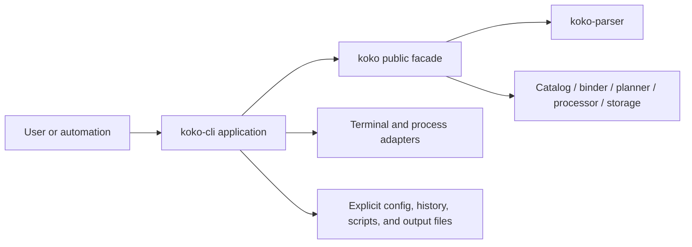
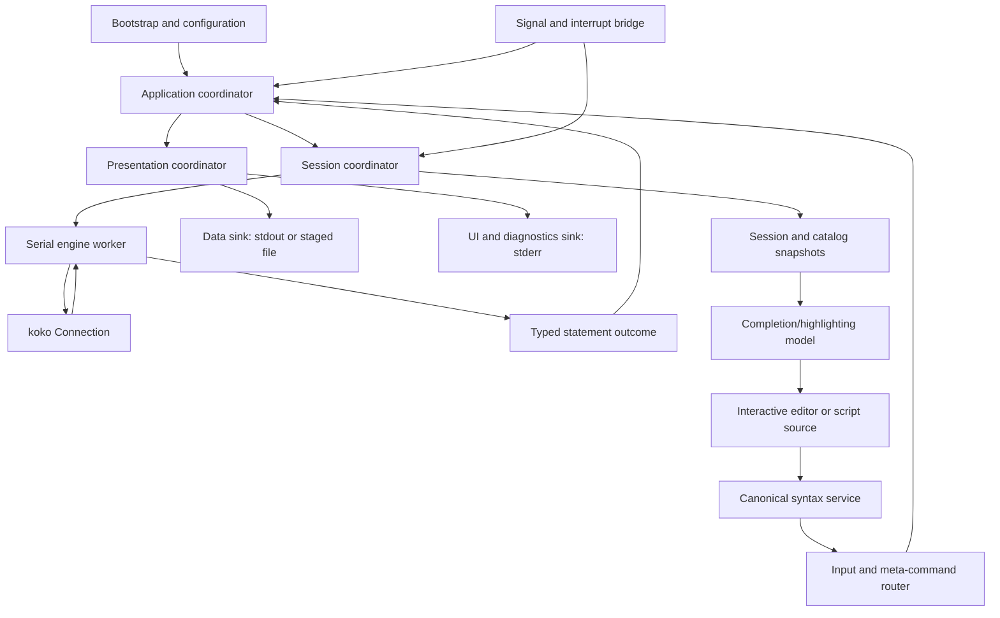

# Koko CLI architecture

> **Status (2026-07-26): implemented and current.** This document owns component boundaries, state
> ownership, data flow, and integration contracts for Koko's first-party Rust CLI.
> [`CLI_UX.md`](CLI_UX.md) remains authoritative for observable behavior.
> [`CLI_PLAN.md`](CLI_PLAN.md) is the completed historical implementation record, not an active
> sequence or verification policy.
>
> [`ROADMAP.md`](../ROADMAP.md) owns the engine product boundary and post-v0 operating rules. This
> architecture does not reactivate native durability, extensions, connectors, projected graphs,
> foreign bindings, or any other owner-deferred engine surface.

## 1. Architectural outcome

Koko has a first-party workspace crate named `koko-cli` whose installed binary is `koko`.
The binary remains a thin process entry point; a library-owned application core coordinates
startup, input, one embedded `koko::Database`, one `koko::Connection`, presentation, and
process exit. All Cypher execution still goes through the public embedded Rust API.

The architecture makes seven load-bearing decisions:

1. **One engine, one session authority.** The CLI owns no graph, transaction, catalog, query, or
   storage semantics. The `Connection` remains authoritative, and the CLI displays immutable
   snapshots obtained from it.
2. **One canonical syntax implementation.** Script segmentation, completeness, token spans, and
   completion context come from tooling views backed by `koko-parser`; the CLI does not implement a
   second Cypher lexer or balance braces heuristically.
3. **A serial session boundary.** One session coordinator submits statements in source order to one
   connection. Interactive execution may run on a dedicated worker so the terminal thread remains
   responsive, but it never creates a second query path.
4. **Typed results, not rendered engine strings.** Formatters consume `QueryResult` columnar batches,
   `LogicalType`, and `Value`. The corpus-oriented `Value::to_result_string` is not a universal CLI
   renderer.
5. **One owner for every output byte.** Result data goes to the selected data sink; diagnostics,
   prompts, summaries, and progress go to stderr. Engine workers never write terminal output.
6. **Transactional file output and explicit machine protocols.** File destinations stage and commit
   atomically. JSON and JSONL are protocol state machines that can close correctly after an engine
   error or cancellation.
7. **Boring concurrency.** The CLI needs standard threads, bounded message passing, and lock-free
   interruption—not an async runtime, parallel statement execution, or a background query service.

The current `crates/koko/examples/koko_cli.rs` remains a deliberately narrow differential-probe
adapter. It is not promoted into the product shell and does not define product UX.

## 2. Authority and boundaries

| Artifact or layer | Owns | Does not own |
|---|---|---|
| `CLI_UX.md` | User-visible behavior, formats, interaction, acceptance criteria | Crates, state ownership, dependency direction, implementation order |
| This document | Component boundaries, state owners, data contracts, control flow, failure containment | Dependency versions, task ordering, detailed algorithms, final test commands |
| [`CLI_PLAN.md`](CLI_PLAN.md) | Concrete dependencies, implementation slices, migrations, verification sequence | Silent changes to UX or architecture |
| `ROADMAP.md` | Engine scope and permanent deferrals | CLI interaction policy |
| `koko` facade | Database, connection, query, transaction, result, memory, and tooling truth | Terminal state and CLI preferences |
| `koko-cli` | Process lifecycle, input, display state, parameters, history, and output routing | Cypher semantics, catalog mutation, transaction state, graph state |

If these artifacts conflict, `CLI_UX.md` wins for observable CLI behavior and `ROADMAP.md` wins for
engine scope. An architecture or implementation convenience is not grounds to weaken either one.

### 2.1 In scope

- One in-memory database and one connection per process.
- Interactive TTY use, command/file/piped batch use, and explicit initialization scripts.
- Typed and `ANY` graphs through the same connection API.
- Parser-aware editing, completion, highlighting, history, parameters, meta commands, all required
  human and machine formats, cancellation, deadlines, progress presentation, and atomic output.
- Small additive public tooling APIs needed to observe existing engine state without parsing human
  strings or reaching into private engine crates.

### 2.2 Out of scope

- A second query parser, binder, planner, interpreter, transaction manager, or result model.
- Native database paths, WAL, recovery, pages, compression controls, attached databases, remote
  sources, authentication, extensions, projected graphs/GDS, Arrow C, or foreign bindings.
- Multiple simultaneous CLI connections, parallel statement execution, a daemon, client/server
  protocol, TUI graph visualization, or an embedded language server.
- General filesystem, terminal, or storage abstraction layers inside the engine.
- Concrete implementation phases, library selection, and dependency versioning; those belong to
  [`CLI_PLAN.md`](CLI_PLAN.md).

## 3. System context and dependency direction

The product executable sits above the existing embedded facade. It may use ordinary Rust libraries
for argument parsing, terminal editing, Unicode width, serialization, configuration, and platform
paths, but it does not depend directly on `koko-catalog`, `koko-storage`, `koko-binder`,
`koko-planner`, or `koko-processor`.



The `koko` facade exposes stable, immutable tooling views backed by the existing parser and
connection internals. That keeps the CLI on the same side of the crate DAG as every other embedded
application and prevents terminal requirements from leaking down into engine crates.

The new crate has two architectural layers:

- **Process shell:** the minimal `main`, real stdin/stdout/stderr, environment, signals, terminal,
  clock, and filesystem adapters.
- **Application core:** typed startup configuration, input units, command routing, session
  coordination, completion, presentation, and exit policy. It contains no global terminal or
  process state and can be driven by integration harnesses.

The process shell depends on the application core; the application core depends on `koko` and on
narrow platform/presentation capabilities. The engine never depends on the CLI.

## 4. Runtime component model



### 4.1 Component responsibilities

| Component | Responsibility | Explicitly forbidden |
|---|---|---|
| Bootstrap | Parse argv, load and validate config, resolve precedence, select modes, validate paths | Opening a database for help/version or before usage/config validation succeeds |
| Application coordinator | Own the process state machine and order input, execution, rendering, and exit | Executing Cypher or writing directly to terminal handles |
| Input frontend | Produce source-preserving logical input units from editor, command, file, init, or stdin | Splitting Cypher with ad hoc string rules |
| Canonical syntax service | Return statement spans, completeness, lexical styles, diagnostics, and cursor context | Binding, planning, or guessing semantic success |
| Meta-command router | Parse one documented `:` grammar from a central command registry | Treating unknown commands as Cypher or interpolating command text into Cypher |
| Session coordinator | Serialize statement execution, parameters, state observation, and error policy | Mirroring graph/transaction state as writable CLI state |
| Engine worker | Own and invoke one `Connection` during interactive work | Terminal I/O, command parsing, unbounded queues, concurrent calls on the connection |
| Metadata service | Publish immutable session/catalog/function snapshots and revisions | Returning mutable catalogs or private storage handles |
| Completion service | Combine syntax context, immutable metadata, parameters, paths, and command specs | Running queries per keystroke or completing inside comments/string literals |
| Presentation coordinator | Classify outcomes and drive one renderer and output transaction | Reinterpreting engine errors or constructing a second materialized row set |
| Machine value codec | Encode/decode the normative typed JSON representation | Lossy numeric conversion, unordered object conversion, or schema-blind graph encoding |
| Output router | Keep data and diagnostic channels separate; stage file writes | Redirecting prompts/diagnostics with result data |
| Terminal driver | Raw-mode lifetime, dimensions, capabilities, redraw, paste, and key events | Owning session semantics or writing from signal handlers |
| History store | Private persistence, normalization, deduplication, search, and skip/off/clear policy | Recording parameters or history-control commands |

### 4.2 Central registries

Two declarative registries prevent parser/help/completion/config drift:

- A **command registry** owns each meta-command name, argument grammar, help topic, completion kind,
  sensitivity/history policy, and dispatch identifier.
- An **option registry** owns each CLI/config setting's type, default, accepted values, scope,
  command-line spelling, config key, and whether it is mutable interactively.

Help, suggestions, completion, config validation, and command parsing consume these registries. A
command or option is not added by teaching five unrelated match statements the same string.

## 5. State ownership

### 5.1 Authoritative state table

| State | Authority | CLI representation | Mutation path |
|---|---|---|---|
| Database contents and graph registry | `Database` | None; immutable metadata snapshot only | Cypher through `Connection` |
| Selected graph and graph kind | `Connection` | Last acknowledged `SessionSnapshot` for display | `USE GRAPH` through normal query execution |
| Transaction mode and lifetime | `Connection` | Last acknowledged `SessionSnapshot` for prompt/exit policy | `BEGIN`/`COMMIT`/`ROLLBACK` through normal execution |
| Query timeout and worker count | `Connection` | Effective values in session snapshot | Public connection settings APIs or supported Cypher settings |
| Tracked engine memory | `Database` | Point-in-time `MemoryUsage` | Engine admission/release only |
| Catalog, functions, macros, indexes | Engine graph/connection state | Immutable revisioned metadata snapshot | Normal DDL/UDF APIs |
| Query parameters | CLI `ParameterStore` | Typed value plus source metadata; values redacted by default | Flags, parameter file, `:param`, `:param clear` |
| Format, width, rows, human NULL display, delimited NULL token, timing, progress, color | CLI session preferences | Typed resolved setting with source | Config, init, flags, meta commands |
| Current input and cursor | Interactive editor | UTF-8 text plus grapheme-safe cursor/selection | Editor events only |
| Output destination | Output router | Active destination descriptor, never a raw global handle | Bootstrap or `:output` |
| History | History store | Bounded normalized entries | Successful submission admission and history commands |
| Active query UI | Application coordinator | Ephemeral running/cancelling/timing state | Worker lifecycle events and interrupts |

The cached session snapshot is a read model, not a second state machine. It changes only after the
engine reports a newer snapshot. Prompt text, transaction exit protection, and `:status` never infer
state by scanning submitted statement text or result messages.

### 5.2 Application state machine

At the process level:

```text
bootstrapping -> ready -> executing -> presenting -> ready -> exiting
                     \-> reading/inclusion --------/
executing -> cancelling -> presenting-error -> ready-or-exiting
any state -> fatal-output-or-process-error -> exiting
```

Only one state may own terminal editing at a time. Only `executing`/`cancelling` has an active engine
request. Rendering completes before the next statement is submitted, which bounds live
`QueryResult` ownership and preserves source-order output.

## 6. Implemented `koko` tooling contracts

The CLI reuses the public facade: `Database::new`, `Connection::execute`/`execute_with`, prepared
metadata, `InterruptHandle`, `QueryResult`, `QuerySummary`, typed `Parameter`/`Value`/`LogicalType`,
and `Database::memory_usage`. Metadata-preserving execution enters the same runtime through
`execute_detailed`/`execute_detailed_with`.

Narrow general-purpose tooling contracts now provide the structured observation needed for truthful
prompts, coherent completion, parser-backed attribution, and lossless tagged parameters. Their
public Rust names live in the facade's `tooling`, `execution`, and `diagnostics` namespaces; their
semantics are fixed here.

### 6.1 Session snapshot

A connection can return one immutable snapshot containing:

- a monotonically changing session revision;
- selected graph stable identity, display name, and typed/`ANY` kind;
- transaction state: none, read-only, or read-write;
- effective timeout and worker count;
- the selected graph's catalog revision and the database graph-registry revision; and
- any read-only session condition that genuinely exists in the engine.

Snapshot capture uses the same connection serialization rules as queries. In an active transaction
it describes the transaction's actual graph and catalog view. If a concurrently dropped selection
would fall back to `main`, the engine resolves that before publishing the snapshot. No private
writer IDs, locks, or mutable catalogs escape.

### 6.2 Catalog and completion snapshot

A connection can return one coherent, immutable tooling snapshot for its current view:

- visible graphs and graph kinds;
- visible node/relationship labels, properties, types, primary keys, relationship endpoints, and
  indexes;
- macros, built-in and connection-local functions with kind/signature/return type;
- recognized settings and accepted types/values; and
- revisions for the registry, selected catalog, and connection-local function set.

An active transaction sees its own uncommitted catalog changes. Hidden implementation tables such as
`_nodes` and `_edges` remain hidden. The snapshot is data, not an iterator borrowing an engine lock;
completion and rendering may retain it after capture without blocking queries.

The existing canonical catalog/schema rendering used by logical interchange is exposed or factored
for `:schema`; the CLI does not maintain a second DDL printer. Object descriptions are structured
metadata, not parsed `SHOW_*` strings.

### 6.3 Canonical syntax analysis

A facade tooling service backed by `koko-parser` accepts source text and an optional cursor and
returns:

- lexical tokens and byte spans, including comments and literal boundaries;
- logical statement spans that honor quotes, comments, nesting, and semicolons;
- `empty`, `incomplete`, `complete`, or `invalid` status;
- a real structured diagnostic span when the parser has one;
- statement class and output class without binding; and
- cursor context sufficient to rank keywords, labels, relationship labels, variables, properties,
  functions, parameters, settings, and paths.

Execution still calls `Connection::execute` or `execute_detailed`; the normal engine result/error
remains authoritative. Analysis is for interaction and source attribution only. Forced submission
may execute text classified as incomplete/invalid so the user receives the normal engine error.

### 6.4 Typed parameter submission

The JSON contract can carry a logical type that a bare `Value` does not always retain—for example a
surface timestamp resolution or an explicitly tagged integer type. `Parameter::typed` validates
that pair, and `Connection::execute_with` binds it without interpolating Cypher source. Untagged
parameters use `Parameter::new`; the CLI selects the typed form when an input tag supplies type
information.

Parameter names and duplicate detection remain binder/CLI input concerns respectively. The CLI
never serializes a parameter back into Cypher source.

### 6.5 Result traversal and graph-value metadata

Renderers traverse the materialized columnar result through borrowed `Row` and `Cell` views,
including strings, blobs, nested values, JSON, nodes, relationships, and paths. The CLI does not
build a second `Vec<Vec<Value>>` representation.

Machine encoding receives the declared logical type recursively. A result also retains or can
resolve the immutable catalog/type context needed to encode typed node and relationship properties,
even if the live catalog changes after execution. Dynamic `ANY` properties retain their ordered JSON
semantics. This is essential for the exact JSON mapping in `CLI_UX.md` §17.3.

`EXPLAIN` and `PROFILE` expose an engine-owned plan presentation payload distinct from ordinary row
results. The payload describes the Rust planner/operator tree and available profile measurements; it
does not imitate C++ operator names or box art, and the CLI never parses a debug string into a plan.
This preserves the intentional `explain-profile-plans` divergence while satisfying the dedicated
plan presentation contract.

### 6.6 Progress observation

The baseline progress contract needs only statement lifecycle and elapsed time, which the CLI can
observe around the synchronous query call. Optional engine progress snapshots may expose processed
rows or a meaningful bounded fraction through monotonic atomics. Absence of those fields means the
UI shows a spinner and elapsed time; it never invents a percentage or estimates work from output
rows.

No progress API may callback into terminal code or make the processor depend on `koko-cli`.

### 6.7 Statement diagnostics

A completed statement exposes its own retained warning records and total warning count as immutable
result metadata. Reading them does not clear the connection's warning history or issue a recursive
`SHOW_WARNINGS` query. The warning records retain query identity and source fields supplied by the
engine; the CLI only presents them.

### 6.8 Failure identity

A failed statement exposes the unchanged engine `Error` plus stable structured diagnostic metadata
for parser, binder, catalog, transaction, runtime, import/export, tracked-memory, interruption, and
internal-panic classes. The metadata carries an authoritative one-line headline, an optional real
source span, and—when interrupted—explicit-request or deadline-expiry cause. It is constructed where
the failure originates; the CLI never splits or pattern-matches `Error` Display. Existing Display
text remains unchanged for embedding/corpus compatibility.

A caught internal panic is never flattened into an ordinary runtime failure for tooling. It is
tagged as an internal product fault so the CLI can restore the terminal, close a machine envelope
when safe, and take the fatal path without presenting panic/backtrace text as a user query error.

## 7. Bootstrap and mode selection

Bootstrap is deliberately split into validation and activation.

### 7.1 Validation-only stage

Before opening a database:

1. Parse enough argv to honor help/version immediately.
2. Parse the complete argv against the option registry; reject unknown flags, missing values,
   mutually exclusive inputs, invalid parameters, and invalid format combinations.
3. Locate and parse the user config unless `--no-config`; reject unknown/invalid keys with source
   location and accepted values.
4. Resolve built-in, config, and command-line CLI settings without inventing resource or storage
   options not present in the UX contract.
5. Resolve input mode and result destination independently from stdin/stdout/stderr capabilities.
6. Validate explicit input/output paths and output-collision policy without executing content.

Help and version stop after step 1 and create no database. Usage/configuration failures stop before
engine activation with exit 2.

Version text comes from the running `koko` library/facade, not a duplicated CLI constant. Path
arguments remain platform path values rather than being lowercased or round-tripped through query
text; query text, tokens, and parameter JSON retain their original UTF-8 bytes. Parameter-file
decoding requires one top-level object, then unique inline parameters overlay it. Repeating an
inline name is rejected rather than treated as another precedence layer.

### 7.2 Activation stage

After validation:

1. Create exactly one in-memory `Database`; there is no native path or uncontracted construction
   flag.
2. Open exactly one `Connection` and capture its initial session/metadata snapshots.
3. Apply config-derived live CLI/session settings.
4. Execute the explicit `--init` source in the live session.
5. Apply command-line live overrides so they outrank changes made by init.
6. Install the requested data destination and then enter command, file, piped-stdin, or interactive
   mode.

This preserves the UX precedence for live settings. No implicit current-directory file is inspected
or executed.

## 8. Source model and statement boundaries

Every submitted unit carries:

- exact normalized UTF-8 logical source text;
- origin kind (interactive, command line, stdin, init file, or included file);
- source name/path and starting line/byte offsets;
- canonical statement or command spans; and
- an include-chain reference when read from a file.

Diagnostics use this source object; they do not reconstruct lines from trimmed statements. Query
text passed to the engine preserves the user's bytes except for removing the outer source span and
the documented interactive continuation markers.

### 8.1 Interactive input

The editor keeps one logical UTF-8 buffer. Enter behavior depends on the editor mode and cursor:

- blank input does nothing;
- with multiline disabled, Enter submits the current physical line unless an explicit forced-newline
  gesture or marker is present;
- with multiline enabled and the cursor away from the end, Enter inserts a newline;
- at the end of an incomplete buffer, Enter inserts a newline and shows the continuation prompt;
- at the end of a complete or invalid-but-complete buffer, Enter submits so execution can return the
  authoritative engine result or error.

`Ctrl-J` force-submits. `Alt-Enter`, or `Esc` followed by Enter when the terminal cannot distinguish
it, inserts a newline even in a complete buffer.

The editor recognizes an explicit continuation marker only when the canonical tooling token stream
contains a standalone `\` operator token followed solely by physical-line whitespace. A marker
inside a string, backtick identifier, line/block comment, or meta-command line is ordinary source
text. This reuses `koko::analyze_cypher`; there is no fragment grammar, quote scanner, second
lexer, or clause-boundary whitelist.

The marker always requests another line, including when the normalized prefix is already
parser-incomplete. Before history admission or `SourceRunner` dispatch, the editor removes every
recognized marker while retaining its newline. Parser status, diagnostics, history, and execution
therefore consume the same normalized buffer. Capable/Reedline input, dumb-terminal input, and
bracketed paste use the same normalizer; command, file, init, and piped sources remain byte-preserved
and never recognize the editor marker. `Ctrl-J` submits the normalized buffer. Switching
singleline/multiline changes representation only; it does not change the engine parser.

### 8.2 Script and batch input

The syntax service segments Cypher with source spans; it is not a `split(';')` helper. A final
unterminated but otherwise complete statement is valid. Incomplete EOF produces one source-located
parser diagnostic and is never silently discarded.
Empty/whitespace segments and redundant trailing semicolons produce no execution unit or result. An
empty piped source therefore succeeds and never transitions into interactive prompting.

Statements and meta commands form an ordered stream. A colon is a command introducer only at the
first non-whitespace position of a new logical input boundary and outside comments/literals. The
meta-command parser has its own small, documented grammar; it is not a query language.

### 8.3 Includes

`--init` and `:read` push a source frame. Relative paths resolve against that frame's directory.
Canonical file identity is tracked in an include stack so a cycle reports the complete chain. Files
must be local UTF-8. Popping a frame restores the parent origin while retaining all deliberate live
session changes.

## 9. Session execution

### 9.1 One execution path

A Cypher unit becomes a request containing exact statement text, source metadata, and an immutable
snapshot of the current parameter map. The session coordinator invokes the same public connection
query path used by embedded applications. DDL, `USE GRAPH`, transactions, typed/`ANY` graphs,
interchange, and local `icebug-disk` scans receive no CLI special case.

A typed outcome contains:

- statement index and source span;
- statement/output classification from canonical syntax analysis;
- either a typed row/status/plan payload or the unchanged engine `Error` plus failure identity;
- pre- and post-execution session revisions/snapshots as needed for policy;
- a pinned result type/catalog context;
- immutable statement-local warnings and total warning count; and
- timing already reported by `QuerySummary` plus wall-clock lifecycle data where relevant.

The presentation layer uses statement classification to distinguish row results, status messages,
and silent results. It never guesses from column names or message text.

### 9.2 Interactive worker

Interactive mode keeps terminal event handling on the main/UI thread and moves synchronous
connection calls to one long-lived worker. A bounded request channel permits at most the active
request plus one handoff; a bounded response channel returns one outcome. The connection has one
owner and requests remain serial.

The UI shares only the connection's cloneable `InterruptHandle` with the signal/terminal path. It
cannot issue introspection or a second query while execution is active. After an outcome, the worker
captures authoritative state before accepting another request.

Batch mode drives the same session coordinator and outcome model. It may call synchronously because
there is no interactive redraw requirement; that is an adapter choice, not a second execution
semantics path.

### 9.3 Graph and transaction consistency

The prompt renders only the last engine-acknowledged session snapshot. A successful or failed
statement is followed by snapshot refresh before the next prompt. Thus:

- a successful `USE GRAPH` changes the prompt;
- a failed switch does not;
- a transaction marker reflects the engine's actual read-only/read-write mode;
- an engine-aborted transaction disappears when the engine reports it;
- a dropped selection shows the engine's authoritative replacement, or `?` while validity is
  unresolved; and
- `:status`, `:graphs`, `:schema`, and completion observe coherent revisions.

Exit protection consults the session snapshot. Normal EOF or `:quit` with an active transaction
refuses once in interactive mode; `:quit --rollback` explicitly executes rollback. Batch EOF with an
active transaction explicitly rolls back and exits nonzero rather than relying on object drop.

### 9.4 Parameters

`ParameterStore` is connection-session-local CLI state. Each entry contains normalized name, typed
value, and source (`file`, command line, or interactive) but never a displayable secret string.
Command-line duplicates are rejected; later precedence layers replace earlier values deliberately.
Every statement receives the complete immutable map at submission time.

`:params` reports names, logical types, and origins by default. Values are accessed only by an
explicit values request or an authoritative engine error that already contains one. Parameter
commands are excluded from history.

### 9.5 Error continuation

The runner records whether a statement began in autocommit or an explicit transaction from the
pre-execution session snapshot. Default batch policy stops on the first failure. `--keep-going` may
continue only independently executable autocommit work; it never crosses an explicit transaction
failure, startup/init failure, unusable output sink, or malformed input boundary.

This policy does not parse transaction keywords or error strings. It uses engine state and source
stream classification.

## 10. Interactive terminal and editor

### 10.1 Terminal ownership

The terminal driver owns raw-mode entry/exit, bracketed paste, dimensions, capability detection,
redraw, and restoration. Its lifetime is guarded so ordinary errors, cancellation, panic unwinding,
and normal exit restore the terminal. A signal handler performs only async-signal-safe notification;
it never writes ANSI sequences or touches engine locks.

The editor renders to stderr, matching the prompt/diagnostic channel contract. Capability detection
is based on the actual UI destination, not merely stdin. Redirected or dumb terminals use a plain
fallback with no cursor-addressing assumptions.
`TERM=dumb` selects a functional line-oriented prompt with no cursor-addressed redraw, box drawing,
live progress, or completion menu; it does not disable query entry or plain completion/error text.

### 10.2 Text model

Source remains one UTF-8 `String`; cursor and selection positions are byte offsets proven to lie on
grapheme boundaries. A display map derives terminal rows/columns from grapheme width, tabs, newlines,
prompt width, and current terminal dimensions. Editing operates on grapheme ranges, never terminal
columns or raw bytes.

Resize invalidates only the display map and redraws the same source/cursor state. Pasted text is one
edit transaction. Bracketed-paste boundaries suppress execution and completion until the paste
closes. Using canonical literal spans, pasted tabs outside quoted strings become four spaces while
literal tabs/newlines inside strings retain their content; already escaped text is not rewritten.
Invalid UTF-8 is rejected before buffer mutation. Large-paste redraw may be throttled, but no input
is dropped.

### 10.3 Key and exit state

The documented key bindings map terminal events to editor commands in one keymap. History search is
an editor substate with its own buffer and reversible acceptance. Escape/`Ctrl-G` leaves that state
without mutating the original buffer.

The two-interrupt empty-prompt exit rule is an explicit UI state containing the previous interrupt
time/sequence. Any edit, submission, command, or elapsed reset clears it. It is unrelated to query
cancellation state.
Before the second interrupt becomes an exit, the coordinator consults the authoritative session
snapshot; an active transaction invokes the same refusal path as `:quit`/Ctrl-D and resets the exit
sequence.

## 11. Completion and highlighting

Completion is a pure query over four immutable inputs:

1. syntax analysis at the cursor;
2. the latest coherent engine metadata snapshot;
3. the parameter store's name/type view; and
4. the command/option registries plus local path context.

A completion candidate separates display label, insertion text, symbol kind, logical type/signature,
source, replacement span, and rank. This permits quoting an identifier correctly while displaying
its plain name and type. Ranking applies the UX order deterministically: exact prefix, valid scope,
selected graph, variables/properties, schema objects, keywords, then fuzzy matches. Fuzzy matching
never makes an invalid-scope candidate outrank a valid one.

The cache key includes graph-registry, selected-catalog, function/UDF, and parameter revisions.
After successful catalog/graph/UDF/parameter changes, the old immutable snapshot remains safe for the
current redraw but is replaced before the next completion request. A cheap revision check avoids
rebuilding catalog data on every keystroke.

The syntax service, not the CLI, identifies comments, strings, tokens, and incomplete constructs.
Highlighting decorates those spans and may overlay a genuine parser diagnostic. Semantic coloring
uses metadata only when unambiguous. With color disabled, styles vanish without changing text;
syntax errors retain a non-color cue where the terminal can represent one.

Completion never binds or executes the partial query. Scope/variable suggestions are conservative:
unknown partial syntax reduces candidates rather than inventing a second binder.

## 12. Meta-command architecture

The command router consumes the central registry and produces typed command values. It rejects
unknown commands, unused trailing arguments, invalid enum values, and malformed numbers before
dispatch. Suggestions use the same names exposed to help and completion.

The registry also declares whether a command is interactive-only, whether it needs destructive
confirmation, and whether omitting a value is a read operation. This makes batch rejection,
`:history clear` confirmation, and setting-value/accepted-choice display policy structural rather
than scattered dispatch behavior. Numeric zero is handled as a literal value, never as an alias.

Commands dispatch by ownership:

| Command family | Owner and data path |
|---|---|
| `:help`, `:quit`, `:clear` | Application/terminal control; no engine query |
| `:status` | Join one engine session/memory snapshot with redacted CLI preferences and parameters |
| `:schema`, `:graphs`, `:describe`, `:functions` | Immutable engine tooling snapshot/canonical schema renderer |
| `:format`, `:timing`, `:progress`, `:rows`, `:width`, `:null` | Typed CLI preference update |
| `:multiline`, `:highlight`, `:completion` | Editor preference update |
| `:history` | History store operation |
| `:param`, `:params` | Parameter store operation and machine-value decoder |
| `:output` | Transactional output-router transition |
| `:read` | Push an explicit source frame into the same ordered runner |

No command synthesizes hidden Cypher merely to mutate shell state. Conversely, Cypher state changes
remain Cypher: graph selection and transactions are not implemented as meta-command shortcuts.
Metadata commands do not recursively call `Connection::query` while holding CLI locks; they request
one facade snapshot through the serial session boundary.

`:status`, `:graphs`, `:describe`, and `:functions` adapt immutable metadata to the same typed
presentation view used by renderers, so they honor the selected format. `:schema` uses the canonical
schema script in human formats and a single `statement STRING` column in machine formats. Object
lookup either resolves uniquely or returns the matching candidates; it never chooses an ambiguous
name.

Static help text is organized by registry topics, while engine-derived function/type information is
queried only for topics that need it. Help and completion cannot disagree on command spellings.

## 13. Presentation and output

### 13.1 Channel routing

The output router exposes three logical channels:

- **Data:** selected result payload and explicit informational command output; defaults to stdout.
- **Diagnostics/UI:** greeting, prompts, errors, warnings, summaries, hints, and progress; always
  stderr.
- **Terminal control:** redraw/erase/control sequences for the diagnostics/UI destination only.

All physical writes are serialized by the presentation/UI owner. The worker returns data structures
and lifecycle events, never bytes. Before a diagnostic or result is printed, any progress line is
cleared; afterward the prompt is redrawn from state. This prevents asynchronous terminal corruption.

Format selection stores both the requested selector and the effective renderer. `auto` is
re-resolved from the current data destination's capabilities whenever that destination changes;
an explicit format remains selected. Input mode never participates in that decision. A quiet-policy
gate suppresses only greeting and nonessential success prose, never requested data, errors, warnings,
or required transaction/cancellation notices.

Broken-pipe and write failures are output errors, not engine errors. The router stops further
execution when the destination cannot preserve its contract.

### 13.2 Renderer contract

Every renderer consumes the same typed result view and emits through a fallible writer. A renderer
has invocation lifecycle methods conceptually equivalent to:

```text
begin invocation
  begin result(schema, statement metadata)
    write row(value views)
  end result(summary)
  write status/error when the format defines one
end invocation
```

No renderer owns a connection, executes a query, or mutates session state. `trash` uses the same
lifecycle but suppresses row bytes.
The renderer registry contains `box`, `table`, `csv`, `tsv`, `json`, `jsonl`, `markdown`, `line`, and
`trash`; `auto` selects one of them. Unsupported legacy names are errors, not aliases.

The presentation coordinator classifies DDL/status results before rendering. Human status and timing
stay on stderr. JSON/JSONL represent status and errors in their documented machine records while the
human diagnostic also goes to stderr.

The source manifest supplies the total row-producing result count before human payload is emitted,
so headings can say `Result N of M` without buffering completed results. Status-only statements do
not increment that count.

### 13.3 Human tables

Box and ASCII table renderers share one layout engine parameterized by border glyphs. The layout
engine:

- selects head/tail row indices without copying result rows;
- shows every retained column's name and exact logical type, including duplicate positional names;
- right-aligns numeric cells and left-aligns text and graph cells;
- measures grapheme display width rather than bytes or scalar count;
- excludes ANSI/style sequences from every width calculation;
- preserves first/last columns and inserts a visible omission column when width requires it;
- shortens oversized cells only at grapheme boundaries and includes a visible ellipsis;
- renders NULL as `NULL`, empty strings as `''`, and embedded controls as visible escapes while
  retaining canonical engine formatting for other scalar and graph values;
- still renders schema and counts for a zero-row result; and
- reports returned, displayed, and omitted row/column counts separately.

The default bounded display may retain formatted strings only for the small displayed window. An
unlimited display performs bounded/two-pass measurement over the already materialized result rather
than constructing another complete row matrix.
Presentation state records whether the once-per-session `:rows all` hint has been shown. Truncation
is labeled as display policy and never described as a query `LIMIT`.

Display truncation applies only to interactive human output on a TTY. Batch, redirected, and machine
output is never row- or column-truncated. Zero-column status outcomes bypass table borders, and
`EXPLAIN`/`PROFILE` use the dedicated plan renderer rather than an ordinary one-column table.

Markdown and line output reuse the value formatter but not terminal borders. CSV and TSV use
format-specific escaping; they never inherit human truncation or ANSI styling.

The delimited renderer owns headers and a dialect-specific cell encoder: RFC 4180 quoting for CSV
and explicit backslash/tab/CR/LF escaping for TSV. Its configurable NULL token applies only there;
quoting/escaping keeps a literal equal token and an empty string distinguishable from NULL.

### 13.4 One machine value codec

A single recursive codec implements `CLI_UX.md` §17.3 for output, JSONL, inline parameters, parameter
files, and `:param`. It always receives a `Value` and its declared `LogicalType` (plus pinned graph
metadata when graph properties require it). Its invariants are:

- integers outside the interoperable JSON range are decimal strings in typed wrappers;
- decimals never pass through binary floating point;
- finite floats use shortest round-trippable text and non-finite values use typed wrappers;
- ordered JSON objects, struct fields, map entries, union alternatives, and graph properties retain
  order and shape;
- duplicate parameter names/object members that would be lossy are rejected where the input
  contract requires uniqueness;
- blobs use standard padded RFC 4648 Base64;
- relationship endpoints remain identities rather than duplicated endpoint nodes; and
- the raw-JSON escape wrapper prevents `$type` collisions.

The codec writes directly to the destination. It does not first construct a generic unordered map or
one giant JSON string.

### 13.5 JSON and JSONL protocol state

The JSON document encoder is an explicit state machine:

```text
new -> open envelope -> zero or more closed result objects
    -> complete=true -> closed
    -> complete=false + one structured error -> closed
```

A statement error, deadline, or cancellation closes the current structure, emits the error record,
and closes the envelope before returning a nonzero process status. Only process termination or an
irrecoverable failure of the data writer can prevent syntactic closure; the CLI never claims
otherwise.

JSONL emits one complete record at a time. Schema precedes rows, summary closes success, and error is
terminal for a failed invocation. Record and result indices come from the presentation coordinator,
not renderer-local guesses.

### 13.6 Atomic file destinations

A file output transaction creates a securely opened temporary sibling in the destination directory,
streams all bytes there, flushes and closes it, and atomically renames it only after the invocation
succeeds. Existing destinations are checked again at commit; replacement requires explicit force or
the selected interactive replace policy. Failure removes the temporary file and leaves the old path
untouched.

The transaction boundary is:

- the whole noninteractive process for `--output`; and
- one interactive submission for a persistent `:output` destination.

Interactive replace mode atomically replaces on each successful submission. Append mode stages the
existing bytes and the new complete submission into a sibling before rename; it does not expose a
partially appended result. Append is accepted only when concatenation preserves the selected format;
in particular, a nonempty single-document JSON destination rejects append and recommends JSONL.
Switching destinations first finishes or abandons the current submission, then changes only
subsequent result data.

No full file is held in memory. Path identity, symlink/replacement races, permissions, and platform
rename behavior are handled in the filesystem adapter and verified by the implementation plan.

### 13.7 Ambiguous CSV/TSV output

CSV/TSV may expose at most one row-producing result per invocation. The source/statement descriptors
preflight output topology where it is statically known. When included commands or runtime-dependent
classification prevents proof, a bounded spill gate retains the candidate payload outside stdout
until the invocation is known to contain at most one row result. A second row result fails before any
row data reaches stdout or a committed file.

Status-only messages never enter the CSV/TSV stream. The gate streams to a private temporary file,
not an unbounded memory buffer or duplicate `QueryResult`.

## 14. Cancellation, deadlines, and progress

The signal/terminal bridge sends an interrupt event to the application coordinator. While a query is
active, the coordinator invokes the already captured `InterruptHandle` exactly through its lock-free
API and moves the UI to `cancelling`. The next statement captures a new engine interrupt epoch, so a
late signal cannot poison it.

The UI thread owns a delayed progress timer. Before the delay expires, no progress bytes are written.
Afterward it renders running/cancelling state, elapsed time, and only engine-supplied row/fraction
metrics. Updates are rate-limited and coalesced. Redirected stderr, dumb terminals, explicit off,
quiet batch mode, and `NO_COLOR` suppress or simplify progress as required without changing query
execution.

Engine deadline, explicit interrupt, tracked-memory failure, and other runtime errors remain distinct
authoritative errors. The CLI distinguishes cancellation from deadline expiry through the failure
identity in §6.8, never by substring matching Display text. Partial machine stdout is terminated with
its documented error record where the writer remains usable; human partial output is followed by an
explicit cancellation diagnostic.
A cancelled outcome cannot enter the successful-summary transition.

At an idle empty prompt, Ctrl-C follows the separate two-interrupt exit state. Ctrl-D follows the
buffer/transaction rules from the UX contract. Neither path sends a spurious engine interrupt.

## 15. Configuration, history, and trust boundaries

### 15.1 Typed configuration

Configuration is decoded into the option registry's typed values with source file, line, and key
provenance. Resolution retains each winning source so `:status` can explain effective settings
without showing secrets. Configuration cannot contain Cypher, includes, shell commands, query
parameters, or arbitrary plugin tables.

Platform directory discovery is isolated in a small process adapter. The current directory is never
searched for config/init files. `--no-config` bypasses only the user config; an explicit init remains
explicit.

### 15.2 History

History storage receives only complete normalized logical submissions admitted by policy. It removes
interactive continuation markers, normalizes newline and trailing-whitespace differences for
duplicate suppression, and preserves the remaining submitted Unicode text as one entry. It excludes
parameter-value commands and history clear/off/skip controls.

The store uses the platform state directory and user-only permissions. Directory/file creation is
race-aware and does not follow an unsafe current-directory convention. Retention is bounded by the
configured entry count. `--no-history` is a process-wide hard disable; `skip` is a one-submission
admission flag. Destructive clear requires TTY confirmation and is rejected by command scope in
batch input.

Incremental search uses Unicode-aware case-insensitive matching over an in-memory index while
retaining each entry's original text/newlines. Direction and selected match are search-substate
fields; accepting for submission, accepting for editing, or cancelling perform the distinct
documented transitions without mutating stored history.

History is private local state, not encrypted secret storage. Help states that query literals can be
sensitive and explains off/skip/clear controls.

### 15.3 Explicit script trust

Every executable file is named by `--init`, `--file`, or `:read`. Origin paths flow into diagnostics
and include resolution. One path resolver supports only documented leading-`~` expansion and
source-relative includes; it performs no environment interpolation, command substitution, remote
fetch, or process-wide working-directory change. The loader rejects remote URLs and invalid UTF-8
and reports include cycles.

## 16. Diagnostics, warnings, and exit status

The diagnostic presenter distinguishes CLI usage/configuration/I/O errors from engine errors. For an
ordinary engine failure it writes the structured authoritative headline exactly once, then adds a
source excerpt and marker only when canonical analysis supplied a real span. It never parses a
legacy multiline `Error` Display to recover either part. Binder/runtime errors without spans receive
no fabricated caret.

Human context—source path, line, statement index, include chain, suggestion, and cleanup note—is
structured around that first line. Machine JSON/JSONL gets its separate structured error record from
the same failure object. Parameter values remain redacted unless the engine's authoritative message
already contains one.

The source mapper converts parser byte spans against the original UTF-8 into line and
Unicode/display-column locations. Suggestions are emitted only from structured context: a
high-confidence one-token Cypher failure may consult the command registry, and an unknown command
may use its nearest plausible registered name. Arbitrary engine messages are not fuzzy-matched.

An internal-panic identity bypasses ordinary query-error presentation. The process emits a concise
product-fault diagnostic without raw panic/backtrace text, safely closes any open machine protocol
when possible, restores the terminal, and exits nonzero.

Statement-local warnings come from the outcome metadata described in §6.7 and are rendered on
stderr before the result summary. Observation does not clear the engine's retained warning history,
and warnings never contaminate row formats or change success/failure unless the UX contract says so.

One `ExitDecision` accumulator owns noninteractive process status:

- 0 only when every requested statement and output commit succeeded;
- 1 for engine/import/export/input-file/output failures;
- 2 for invocation/configuration misuse or a malformed meta command in batch/init input;
- 130 when user interruption terminates the batch invocation; and
- a detected active transaction at batch EOF forces rollback and nonzero status.

`--keep-going` records failure but cannot restore exit 0. A fatal output error stops immediately.
Interactive query and command errors return to the prompt rather than becoming a sticky process
status; normal `:quit`/Ctrl-D exits normally, while the documented second Ctrl-C exits 130. Terminal
restoration runs before returning the final status.

## 17. Concurrency, locking, and resource discipline

- One worker owns one connection; statement execution is serial and deterministic.
- Channels are bounded. At most one live request/outcome waits between worker and UI.
- The UI never holds an editor, renderer, history, or output lock while asking the engine to execute
  or snapshot state.
- Engine snapshots are immutable owned data captured under engine coordination and consumed after
  locks are released.
- Signal paths touch only atomics/wakeup primitives and the lock-free interrupt handle.
- Result rendering walks the engine's materialized columnar batches directly; it does not create a
  second complete set of rows or strings.
- JSON/JSONL/CSV/TSV and file copies stream with bounded buffers. Human default truncation retains at
  most its small display window.
- Completion metadata is revisioned and shared immutably. Refresh replaces a snapshot rather than
  mutating data under the editor.
- Database memory limits remain engine limits and are reported as such. CLI buffers are independently
  bounded where the UX permits; disk spooling is used when rollback-before-stdout is required.
- Interactive shutdown joins the worker after cancellation/rollback policy resolves. No detached
  thread may outlive terminal restoration or database drop.

There is no async runtime, process-global mutable connection, unbounded event bus, or generic plugin
system in this architecture.

## 18. Portability and accessibility

A terminal capability snapshot covers TTY status, dimensions, Unicode border support, color level,
cursor movement, bracketed paste, and dumb-terminal fallback. Presentation selects behavior from
capabilities plus explicit user overrides. `NO_COLOR` participates before automatic color choice;
explicit `always`/`never` remains deterministic as defined by the UX contract.

ANSI emission is centralized and absent from machine formats. Completion menus include textual kinds
and signatures, errors use markers as well as color, and progress has a plain-text fallback. Width,
wrapping, cursor motion, and truncation use grapheme/display-width services consistently.

Platform-specific code is restricted to terminal events/restoration, signal wakeup, standard config
and state directories, file permissions, and atomic replacement. Core command, session, format, and
exit policy remains platform-neutral Rust.

## 19. Verification architecture

[`CLI_PLAN.md`](CLI_PLAN.md) maps the UX acceptance matrix onto four complementary harnesses:

1. **Pure component checks:** command/option registries, config precedence, source mapping, completion
   ranking, grapheme editing, layout, every value-codec branch, protocol state machines, and exit
   policy.
2. **Engine integration checks:** real in-memory `Database`/`Connection`, typed and `ANY` graphs,
   session snapshots, transaction abort/rollback, prepared/result metadata, errors, deadlines,
   cancellation, memory failure, and catalog refresh.
3. **Real PTY checks:** raw-mode restoration, prompts, editing keys, parser and explicit
   continuation, multiline paste, normalized history, resize, completion menus, history search,
   progress redraw, Ctrl-C/Ctrl-D, dumb terminal, and color modes.
4. **Real subprocess/file checks:** argv/config failures before database creation, stdout/stderr
   separation, piped/file/init modes, every format, valid JSON/JSONL after failure, broken pipes,
   atomic output replacement, collisions, permissions, Unicode paths, include cycles, and exact exit
   statuses.

Mocks may prove deterministic core state transitions, but they do not replace PTY, subprocess,
filesystem, or real engine evidence. The production binary is exercised end to end. Corpus/differential
engine probes remain engine gates; CLI tests assert the Rust UX contract rather than C++ shell quirks.

Fault injection belongs at narrow process boundaries—writer failure, rename failure, clock/timer, and
signal event—not behind a general VFS or mock database.

## 20. Key alternatives rejected

| Decision | Rejected alternative | Reason |
|---|---|---|
| New `koko-cli` crate with thin binary | Grow the differential `examples/koko_cli.rs` | The example's line protocol and corpus formatting are a test contract, not a maintainable product boundary |
| `koko` tooling snapshots | Parse `SHOW_*`, error, or prompt strings | Human text is not stable typed state and cannot provide coherent transaction-local metadata |
| Canonical parser tooling | CLI lexer, bracket counter, regex statement splitter | It would diverge on comments, escaping, incomplete syntax, and future grammar changes |
| One serial worker | Query on the terminal thread or parallel statements | The former prevents responsive cancellation/progress; the latter breaks connection/session order |
| Standard threads and bounded channels | Async runtime and unbounded event stream | One synchronous embedded connection needs neither complexity nor allocation pressure |
| Typed renderer pipeline | Call `to_result_strings()` then reparse | Loses NULL/type/order information and allocates a second result representation |
| Explicit JSON protocol encoder | Serialize an ad hoc generic map | Cannot guarantee order, duplicate names, exact numbers, graph values, or valid failure closure |
| Sibling-file transaction | Write destination directly and clean up on error | Direct writes cannot preserve an old destination or roll back partial output |
| Revisioned completion snapshot | Query catalog on every keypress | Avoids engine lock traffic, inconsistent views, and UI latency |
| Engine-owned graph/transaction truth | Toggle shell booleans after matching keywords | Text inference fails on errors, rollback, auto-abort, and concurrent graph changes |

## 21. UX traceability

| `CLI_UX.md` contract | Architectural owner |
|---|---|
| §§1–4 product and surfaces | Process/application split and scope boundaries (§§1–4) |
| §5 invocation and mode selection | Bootstrap validation/activation (§7) |
| §6 output channels | Output router and single-writer discipline (§13.1) |
| §7 greeting, prompt, status | Session snapshot plus presentation (§§5–6, 9.3, 12) |
| §8 statement boundaries | Canonical source/syntax model (§8) |
| §9 editing | Terminal/editor text model (§10) |
| §10 completion/highlighting | Revisioned syntax/metadata composition (§11) |
| §11 history/search | History ownership and editor search state (§§10.3, 15.2) |
| §12 meta commands/parameters/help | Registries, router, parameter store (§§4.2, 9.4, 12) |
| §13 human results | Typed renderer and layout engine (§§13.2–13.3) |
| §14 graph/transactions | Engine-authoritative session execution (§§5, 9.3) |
| §15 cancellation/progress | Worker, interrupt bridge, UI timer (§14) |
| §16 errors/warnings/exit | Diagnostic and exit accumulator (§16) |
| §17 all formats and destinations | Renderer, codec, protocols, output transactions (§13) |
| §18 config/init/read | Typed bootstrap and explicit source frames (§§7, 8.3, 15) |
| §19 accessibility/terminal fallback | Capability and portability layer (§18) |
| §20 examples | Composed flows above; no example-only path |
| §21 acceptance criteria | Four real verification harnesses (§19) |
| §22 handoff requirements | Session, parser, output, cancellation, completion, and trust contracts throughout |

## 22. Historical implementation-plan contract

[`CLI_PLAN.md`](CLI_PLAN.md) records how this architecture was landed: dependency selection,
additive facade tooling, module sequencing, convergence on central command/option registries, and
the original `CLI_UX.md` §21 close gate. It also records the decision to retain the narrow
differential adapter without turning it into the product binary.

That plan is complete and must not be resumed as current work. The resulting constraints remain:
the CLI must not add a second Cypher implementation, bypass the `koko` facade, duplicate engine
state, weaken atomic or machine-output guarantees, or activate a deferred engine feature. A future
CLI behavior change updates `CLI_UX.md`; an architectural boundary change updates this document.
