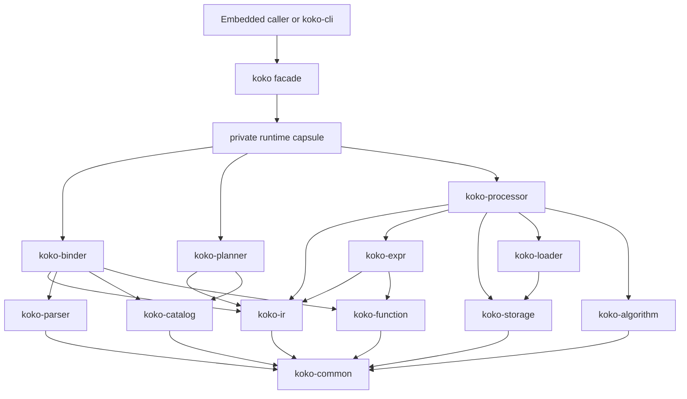
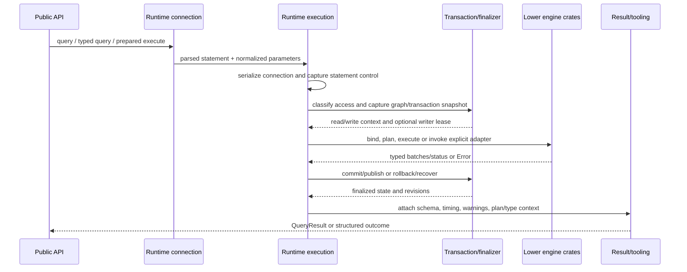

# Koko facade architecture

> **Status (2026-08-08): implemented and current after the idiomatic Rust cutover and built-in
> algorithm-scan foundation.** This document is the authoritative architecture reference for the
> public `koko` facade and workspace dependency boundaries. Sections 1–8 retain the state-ownership
> architecture established by the 2026-07-24 decomposition; sections 9–12 describe the current
> public API and lower-layer cutover.
>
> [`ROADMAP.md`](../ROADMAP.md) owns current product scope, work, limitations, intentional
> decisions, and verification policy. [`CLI_ARCHITECTURE.md`](CLI_ARCHITECTURE.md) owns the
> first-party CLI boundary.

## 1. Architectural outcome

`koko` remains the single public Rust composition root over the parser, catalog, storage, binder,
planner, processor, loader, function and algorithm crates. It is organized as a small public shell,
one private stateful runtime capsule, and cohesive stateless or explicitly contextual adapters.

The runtime decomposition is structural and behavior-preserving. The subsequent 2026-07-25 cutover
made a deliberate clean break in the pre-user Rust API while preserving every engine and CLI contract.

The architecture rests on eight load-bearing decisions:

1. **A composition root, not a second engine.** `koko` owns cross-layer orchestration and the public
   embedded API. Parsing, binding, planning, expression evaluation, physical execution, storage, and
   loading algorithms remain in their existing lower crates.
2. **One runtime capsule owns mutable coordination.** Database, graph, connection, transaction,
   writer-lease, session, and statement lifecycle state lives under a private `runtime` module. No
   adapter may reach into runtime locks or reproduce its state machine.
3. **One execution funnel.** Direct queries, typed queries, prepared statements, transaction guards,
   and metadata-preserving execution converge on one parsed-statement dispatcher and one set of
   commit, rollback, warning, timing, cancellation, and panic-recovery rules.
4. **Explicit snapshots cross boundaries.** Long-running engine work and I/O consume immutable
   `Arc`-backed snapshots or narrow operation contexts. Mutable coordinator guards do not become
   ambient capabilities passed throughout the crate.
5. **Adapters own formats, not transactions.** COPY, Arrow, logical interchange, result views, and
   tooling own their format or view contracts. The runtime owns admission, transaction boundaries,
   publication, and recovery around them.
6. **Observable behavior is deliberate; the pre-user Rust API did not constrain the design.**
   Established Cypher, errors and value rendering, ordering, transactions, concurrency,
   cancellation, memory accounting, Arrow/interchange behavior, and CLI output survived the
   cutover. Post-v0 changes follow Koko's own non-regression policy rather than automatic C++ parity.
7. **Crate boundaries encode real ownership.** `koko-ir` owns shared semantic and physical-plan
   contracts consumed by binder, expression, planner, processor, and facade layers. Other boundaries
   remain concrete; no speculative backend, service, or plugin trait was introduced.
8. **Tests describe contracts without dominating the crate root.** Facade tests live out of
   `lib.rs` while retaining crate-private coverage where required. Tests defend observable behavior,
   not source layout; `docs/TESTING.md` owns the resulting suite taxonomy and fixture policy.

The pre-decomposition layout motivated the work but did not define a line-count target. At the time
of the decision, `crates/koko/src/lib.rs` held about 5,700 nonblank implementation lines and 4,400
nonblank `#[cfg(test)]` lines. At current closure it is a 63-physical-line composition root, while
`runtime/mod.rs` remains a declaration/re-export index. The result is evidence of separated
authority, not a line-count optimization.

## 2. Authority, scope, and non-goals

| Artifact or layer | Owns | Does not own |
|---|---|---|
| `ROADMAP.md` | Product scope, completed milestones and permanent/owner deferrals | Source organization |
| This document | Workspace boundaries, facade API, state owners, dependency direction and runtime flow | Product sequencing or new behavior |
| Lower engine crates | Their explicit layer contracts and algorithms | Public embedded lifecycle or cross-layer orchestration |
| `koko-ir` | Shared bound semantic records, row layouts and logical plans | Binding, optimization or execution algorithms |
| `koko` runtime capsule | Database/connection/transaction coordination and execution lifecycle | Terminal behavior or lower-layer algorithms |
| `koko` public data/adapters | Public result/data contracts and format conversion | Runtime locks, admission or finalization policy |

### 2.1 In scope

- Make semantic, planning, catalog, storage, I/O, execution, and facade ownership structural in the
  crate/module graph.
- Add the narrowly constrained `koko-ir` contract crate and remove producer dependencies from
  expression, planner, processor, and loader layers.
- Decompose implementation roots by Rust responsibility while keeping exports explicit and minimal.
- Replace duplicate string/name dispatch and thread-local semantic state with typed IDs and generated
  descriptors.
- Preserve the runtime capsule, concrete in-memory storage, static physical dispatch, eager columnar
  results, and borrowed row views.
- Redesign the pre-user public Rust facade in one clean cutover and migrate every first-party caller.
- Preserve all observable engine, concurrency, resource-control, interchange, and CLI behavior.

### 2.2 Out of scope

- Native database files, WAL, checkpoint/recovery, persistent catalogs/indexes, page buffering,
  compression, larger-than-memory native storage, or physical storage introspection.
- Extensions/plugins, projected graphs, connectors, remote object stores, Arrow C Data/C Stream,
  foreign bindings, or another deferred product surface.
- A storage-backend trait, async runtime, actor system, event bus, dependency-injection framework, or
  dynamic physical-operator hierarchy.
- Reorganizing lower crates to mirror C++ translation units.
- Public deprecations, aliases, compatibility shims, or a second facade API.
- Algorithmic optimization, lock-model redesign, or memory-layout changes disguised as refactoring.
- An arbitrary maximum file length. Cohesion and authority, not line count, set module boundaries.

## 3. Implemented source shape

The facade ownership is:

```text
crates/koko/src/
  lib.rs                       crate documentation, module declarations, convenience re-exports
  config.rs                    DatabaseConfig and validated database resource configuration
  diagnostics.rs               structured diagnostics, warnings and statement failures
  execution.rs                 owned Parameter and execution metadata
  function.rs                  ScalarFunction registration descriptor
  prepared.rs                  prepared metadata and public PreparedStatement surface
  result/
    mod.rs                     result module exports and shared result contracts
    tabular.rs                 QueryResult, columns, rows and borrowed cell traversal
    cell.rs                    typed borrowed cell extraction
    plan.rs                    plan presentation
  transaction.rs               exclusively borrowing Transaction guard surface
  value.rs                     deliberate LogicalType and Value exports
  tooling.rs                   immutable syntax, session and catalog tooling
  copy.rs                      private COPY adapter
  arrow.rs                     private native Rust Arrow adapter
  interchange.rs               private logical database interchange adapter
  macros.rs                    scalar-macro expansion and params! construction

  runtime/
    mod.rs                     runtime declarations and deliberate facade re-exports
    context.rs                 statement inputs, settings and query-scoped capabilities
    database.rs                Database, coordinator, graph registry and global resources
    graph.rs                   graph identity, snapshots and publication
    connection/
      mod.rs                   Connection, session state, UDFs and interruption
      execution.rs             sole statement dispatcher and bind-plan-execute coordination
      transaction.rs           writer admission, finalization and RAII guard implementation
      prepared.rs              prepared cache, invalidation, refresh and execution delegation
      observation.rs           coherent session/catalog snapshots and structured outcomes

  tests/
    mod.rs                     private test root and shared fixtures
    execution.rs               execution, prepared and result contracts
    transactions.rs            transaction, isolation, conflict and recovery contracts
    concurrency.rs             cancellation, deadlines and writer admission
    interchange.rs             COPY, Arrow and logical interchange contracts
    graphs.rs                  named-graph, index and icebug-disk contracts
    udfs.rs                    scalar-UDF ownership, failure and memory contracts
```

The lower workspace is responsibility-oriented:

```text
koko-common      value/data/memory/statistics primitives
koko-catalog     private catalog entries plus schema-definition inputs
koko-storage     concrete versioned in-memory storage and explicit guards
koko-algorithm   allocation-accounted whole-graph kernels over narrow typed contracts
koko-parser      grammar-family parser modules
koko-function    generated typed function identities, signatures and evaluation
koko-ir          shared bound semantic IR, row layouts and logical plans
koko-binder      binding orchestration over catalog/parser/function/koko-ir
koko-expr        bound-expression compilation and evaluation
koko-planner     planning and optimization over koko-ir
koko-loader      CSV/Parquet/NPY readers and external scan protocols
koko-processor   pull execution, operators, storage-to-kernel adapters and borrowed execution capabilities
koko             public lifecycle, synchronization, adapters and result facade
```

Product modules are fixed by responsibility. Catch-all `util`, `helpers`, `service`, or `manager`
modules are not part of the architecture. The connection subsystems remain below their state owner;
lower crates export only contracts required by a downstream layer.

## 4. Module ownership contracts

| Module | Owns | Must not own |
|---|---|---|
| `lib.rs` | Documentation, module declarations, convenience re-exports | Runtime state, execution, format algorithms |
| `config` | Database resource configuration and validation | Session or mutable database state |
| `runtime::database` | Database, graph registry, commit clock, memory owner, writer registry | Binding/planning or formats |
| `runtime::graph` | Graph identity, published catalog/storage generations and snapshots | Connection policy or formats |
| `runtime::connection` | Session state, graph selection, settings, UDF registry and interruption | Physical operators or rendering |
| `runtime::context` | Statement inputs, MVCC handles, controls, warnings and execution snapshots | Persistent session state or finalization |
| `runtime::connection::execution` | Parameter normalization, statement dispatch and bind-plan-execute composition | Lower-layer algorithms |
| `runtime::connection::transaction` | Transaction state, admission, savepoints, finalization and cleanup | Parsing or result representation |
| `runtime::connection::prepared` | Prepared cache, metadata refresh, invalidation and execution delegation | A second execution path |
| `runtime::connection::observation` | Coherent session/catalog snapshots and structured outcomes | Mutation or query execution |
| `result` | Eager columnar results and borrowed traversal/presentation | Runtime locks or execution |
| `copy`, `arrow`, `interchange` | Format validation and conversion against explicit capabilities | Admission, publication or recovery |
| `tooling` | Immutable syntax, session and catalog descriptors | Mutable runtime authority |
| `macros` | Pure macro expansion and `params!` construction | Binding or hidden execution |

`lib.rs` is an index, not a coordinator. Only runtime modules may mutate lifecycle state, acquire
coordinator/session/transaction locks, admit writers, or choose commit versus rollback. Adapter
modules do not depend on runtime state types: the runtime constructs concrete, narrow contexts from
storage/catalog handles, controls, memory trackers, snapshots, and typed sinks.

Lower crates follow the same rule. Catalog entry fields are private and mutated by their catalog
owner. Storage lock internals stay behind `SharedStorage` guards. Loader protocols own external
readers. Processor operators receive borrowed execution capabilities instead of a database-sized
context. Function descriptors are generated data interpreted by binder and evaluator code.

## 5. Dependency direction



Lower engine crates never depend on `koko`. `koko-ir` contains contracts, not binder/planner/
processor implementations. Producer crates do not acquire dependencies on their consumers.
Cross-runtime references are purpose-specific operations rather than shared mutable field access;
cycles introduced merely to split files are architecture failures.

## 6. State ownership and publication

| State | Sole authority | Read/capture path | Mutation/publication path |
|---|---|---|---|
| Database resource policy and tracked memory | `runtime::database` plus `config` input | Cheap cloned tracker/config view | Database construction only, except counters owned by tracker |
| Graph registry and stable graph identities | `runtime::database` | Immutable registry generation/snapshot | Runtime graph DDL under schema coordination |
| Published graph catalog/storage/macro generation | `runtime::graph` | Cheap `Arc`-backed graph snapshot | Validated commit/publication operation |
| Active writer registry and writer ids | `runtime::database`, driven by `transaction` | Admission query under database coordinator | Acquire/release/failure cleanup only through transaction protocol |
| Selected graph, settings, warning history, session revision | `runtime::connection` | Connection-serialized snapshot | Successful statement/configuration transition |
| Connection-local scalar UDF generation | `runtime::connection` | Immutable `Arc` snapshot plus generation | Register/remove API; existing bound queries retain their snapshot |
| Explicit transaction working view | `runtime::connection::transaction`, stored by connection state | Statement capture under connection serialization | BEGIN creates; successful statements update; COMMIT publishes; error/ROLLBACK drops |
| Statement parameters, deadline, interrupt epoch, warning sink | `runtime::context`, constructed by `runtime::connection` | Constructed once per statement | Statement-local updates applied only after success |
| Prepared AST and metadata token | `runtime::connection::prepared` | Borrowed immutable execution input | Rebuilt after relevant catalog/function revision changes |
| Materialized result batches and metadata | `result` | Borrowed row/column/cell views | Constructed during successful execution; immutable to callers |
| Tooling/session/catalog views | `tooling`, captured by `runtime::connection::observation` | Owned immutable snapshots | Never mutated; recapture after revision change |

### 6.1 Snapshot invariant

A graph query executes against one coherent tuple of:

- graph identity and kind;
- catalog and macro generation;
- shared versioned storage;
- read timestamp and optional writer id;
- database resource configuration and memory tracker;
- relationship-id display bases where required;
- connection settings, UDF generation, cancellation epoch, deadline, and warning sink; and
- statement parameters.

The tuple is captured before lower-layer execution. It is not reconstructed independently by COPY,
prepared statements, tooling, or Arrow import. `Arc` cloning remains shallow; decomposition must not
introduce whole-catalog, whole-storage, result, or parameter copies that do not already exist.

### 6.2 Publication invariant

A successful write publishes exactly the state its transaction mode permits:

- storage versions commit from the statement/transaction savepoint;
- catalog and macro generations publish only when changed and conflict checks pass;
- catalog/session/function revisions advance only for their owned successful transition;
- pending setting updates apply only after successful execution;
- writer leases and catalog-write claims are released exactly once; and
- failures and caught panics roll back to the correct mark and leave no discoverable writer lease.

The implementation should centralize these transitions in transaction/finalization operations rather
than repeat manual cleanup in each statement branch. Centralization must preserve existing observable
semantics; it is not permission to redesign MVCC or conflict policy.

## 7. Canonical execution flow

Every ordinary statement follows this logical flow:



The implementation may arrange parsing before connection serialization where current timing and
concurrency semantics require it. The architectural invariants are:

1. **One parsed dispatcher:** direct and prepared execution share statement classification and
   dispatch after parsing.
2. **One finalization policy:** all write-capable paths use the same transaction-owned acquire,
   commit, rollback, release, and panic-recovery operations appropriate to their scope.
3. **One lower pipeline:** regular queries use the existing binder, planner, optimizer, processor,
   and storage path. Metadata-preserving execution wraps this path; it does not duplicate it.
4. **One ordered reading contract:** the binder preserves each `MATCH`, `OPTIONAL MATCH`, `UNWIND`,
   in-query table-function `CALL`, and `LOAD FROM` as a `BoundReadingClause` with its local
   predicate. The planner folds that sequence left to right. Independent table/LOAD sources are
   opened once and cross-producted with incoming rows; OPTIONAL owns NULL extension; whole graph
   values are materialized before an expression such as a node-valued `UNWIND` consumes them.
   State-mutating table functions remain standalone binder errors.
   Row-producing functions retain their canonical physical output order; explicit `YIELD` bindings
   create exposed variables in caller-written order and anonymous internal variables for omitted
   outputs. Selection and aliasing therefore do not create a second table-function ABI or alter
   source cardinality.
5. **No coordinator during ordinary engine work:** the existing autocommit regular-query guarantee
   remains—database coordination is held only for snapshot/lease transitions, not bind, plan, scan,
   mutation, or materialization. The decomposition must not lengthen any existing lock lifetime.
6. **Explicit exceptional adapters:** graph DDL, index DDL, logical database import/export, Arrow
   import, and dataset loading may need wider atomic coordination, but their lock and transaction
   boundaries remain runtime-owned and visible at the dispatcher.
7. **No implicit side channel:** warnings, settings, timing, cancellation, UDFs, memory, and table
   function context travel in the statement context, not globals or thread-local state.

### 7.1 Entry-point convergence

- `Connection::execute` delegates to `execute_with` with an empty owned parameter set.
- Direct and prepared parameters use the same owned `Parameter` representation before dispatch.
- `PreparedStatement::execute` reuses its parsed AST and refreshable metadata, then enters the same
  parsed dispatcher through its owning connection.
- `execute_detailed`/`execute_detailed_with` capture observation and map the same execution result
  into `execution::Outcome`; they are not a second query implementation.
- `Transaction` methods delegate through their exclusively borrowed `Connection` and the same
  transaction coordinator.
- Dataset loading, Arrow import, and logical import may batch work, but reuse canonical parsing,
  binding, adapter, savepoint, and finalization machinery rather than implementing alternate
  semantics.

## 8. Concurrency, locks, interruption, and recovery

The architecture preserves the completed concurrency model:

- Calls through one `Connection` are serialized.
- Different connections may execute concurrently.
- The schema gate distinguishes ordinary snapshot-safe work from structural publication paths.
- Graph/catalog/storage snapshots are immutable or versioned for query execution.
- The interrupt handle advances a lock-free epoch and never waits for the connection execution lock.
- UDF callbacks execute from an immutable registry snapshot and never under the UDF registry lock.
- Memory accounting and deadlines remain statement-scoped capabilities.

Only runtime modules know concrete lock fields. Multi-lock sections must be small, named capture or
finalize operations with one documented acquisition order in code. Adapter modules cannot acquire a
runtime lock. The refactor must not add a lock around parser, binder, planner, processor, UDF callback,
result iteration, or filesystem/Arrow conversion merely to simplify borrowing.

Panic containment remains part of the facade contract. All execution entry points that currently
contain engine panics must converge on one catch/recover boundary. Recovery is idempotent with respect
to transaction removal, storage rollback, catalog-write release, and writer-registry cleanup. The
original `Error` category and display text remain unchanged for ordinary errors; metadata wrappers may
add structured context only through their existing public contract.

## 9. Public API and representation contract

The pre-user facade was replaced rather than deprecated. The supported embedding vocabulary is:

- root conveniences: `Database`, `DatabaseConfig`, `Connection`, `InterruptHandle`, `Transaction`,
  `PreparedStatement`, `Parameter`, `ScalarFunction`, `QueryResult`, `Row`, `Value`, `LogicalType`,
  `Error`, `Result`, and `params!`;
- focused public namespaces: `config`, `diagnostics`, `execution`, `function`, `prepared`, `result`,
  `tooling`, `transaction`, and `value`;
- `Database::new()` or `Database::with_config(...)`, then `connect()`;
- ordinary `execute`, `execute_with`, `prepare`, graph selection, configuration, scalar-function
  registration, observation, and import methods serialize internally and are available through a
  shared `Connection` reference;
- `transaction()`/`read_transaction()` require `&mut Connection` and return an exclusively
  borrowing `Transaction<'_>` guard, preventing concurrent use of that connection until the guard
  commits, rolls back, or drops;
- one owned `Parameter` representation for direct and prepared execution;
- `PreparedStatement` metadata exposed as ordinary slices and refreshed only through mutable
  prepared execution; and
- eagerly materialized private columnar results, with `Row`, cell, and column views borrowing the
  result buffers without a second row representation.

All first-party callers use this vocabulary. Removed names have no aliases, deprecated exports, or
parallel execution path. The external contract test under `crates/koko/tests/public_api.rs` compiles
and exercises the canonical flow as a downstream crate would.

The byte-for-byte corpus formatting contract and `Error` display prefixes remain unchanged. The
logical database image remains explicit save/restore rather than native durability. Native Rust
Arrow continues to own Rust arrays and remains distinct from deferred Arrow C interfaces.
## 10. Testing architecture

Tests follow the same ownership model:

- Focused private-unit tests live with the module whose invariant they defend.
- Cross-module facade tests live under `src/tests/` so they can retain crate-private access without
  filling `lib.rs`.
- Public black-box integration tests remain under `crates/koko/tests/`.
- CLI tests depend only on the public `koko` facade.
- Manifested product fixtures are fixed end-to-end Koko behavioral regressions. They use only
  bundled datasets, run every case without skips, and derive expectations from current Koko
  contracts rather than automatic Ladybug authority.

Tests must defend observable behavior, state transitions, conflict/recovery invariants, metadata
coherence, and borrowed result contracts. They must not assert module filenames, count source lines,
parse source text, or otherwise freeze mechanical implementation details. The complete placement,
non-duplication, fixture-manifest, and optional-evidence policy lives in
[`TESTING.md`](TESTING.md).

## 11. Rejected alternatives

### 11.1 Mirror the C++ source tree

Rejected. C++ headers, translation units, linker boundaries, and one-class-per-file conventions do not
map to Rust modules. The target uses responsibility boundaries without duplicating declarations or
creating hundreds of tiny files.

### 11.2 Add facade subcrates

Rejected for this effort. `koko` is intentionally the composition root and already sits above a
compile-time-enforced crate DAG. Splitting `koko-result`, `koko-runtime`, or `koko-arrow` without a
separate dependency/feature consumer would expand the public dependency graph and visibility surface
without improving state ownership.

### 11.3 Introduce service traits for each module

Rejected. There is one in-memory database product mode and one facade runtime. Concrete narrow
contexts and owner methods are clearer and compile to less indirection than one-implementation traits.

### 11.4 Perform only a mechanical file split

Rejected. Moving `impl` blocks while exposing every state field as `pub(crate)` would preserve the
same mixed authority with worse navigation. The implementation must establish the ownership and
adapter boundaries in this document, while avoiding unrelated semantic redesign.

### 11.5 Leave `lib.rs` as the runtime coordinator

Rejected. The crate root should explain and expose the facade. Keeping mutable runtime authority,
format adapters, results, and thousands of test lines in the root prevents the architecture from being
visible in the module system.

## 12. Completion contract and closure evidence

The architecture is complete because:

1. `koko-ir` is the sole shared semantic/plan contract crate; dependency metadata proves binder,
   expression, planner, processor, loader, and facade edges remain acyclic and layer-correct.
2. Catalog entries own their invariants privately. Creation crosses typed definition records,
   relationship endpoint pairs have one representation, and serial ownership is structural.
3. Parser, binder, expression, loader, storage, processor, and function implementations are split by
   responsibility rather than C++ translation units; their root modules remain explicit indexes or
   cohesive dispatch owners.
4. Function binding and evaluation share generated typed identities and checked-in declarative
   inputs; `scripts/gen_fn_catalog.py --check` proves deterministic output.
5. Lambda variables use typed IDs carried through binding, IR, compilation, and evaluation. No
   thread-local semantic state or thread-local adjacency scratch remains; reusable neighbor scratch
   is owned explicitly by the relevant operator state.
6. The processor pull machine uses named operator states and borrowed capability contexts. Storage
   guard scope and relationship visibility are explicit, with no per-row trait-object dispatch.
7. `lib.rs` is a 63-line composition root. Only runtime modules mutate lifecycle state or choose
   transaction admission/finalization; adapters consume narrow contexts.
8. The public facade follows section 9. Every first-party caller was migrated in one cutover, and
   exhaustive obsolete-symbol searches found no compatibility surface.
9. Accepted Cypher, engine error/value text, ordering, result materialization, transactions,
   concurrency, cancellation, deadlines, memory accounting, Arrow/interchange, and CLI output retain
   their established behavior.
10. No `unsafe`, async runtime, persistence seam, speculative storage backend trait, plugin surface,
    or owner-deferred feature was introduced.

Final evidence on 2026-07-25:

- `cargo build --workspace` and `cargo test --workspace` passed; the latter ran **401 tests across
  40 suites**.
- `python3 scripts/gen_fn_catalog.py --check`, `cargo clippy --workspace --all-targets`, and
  `cargo fmt --all --check` passed.
- The external public-API contract, package doctests, focused lower-crate tests, and a piped retained
  CLI example passed.
- `python3 scripts/cli_goal_gate.py --strict` passed all **23** PTY/BAT/REG cases with no skip or
  timeout.
- The default and `KOKO_THREADS=1` Ladybug 0.17 corpus sweeps each reproduced the refactor baseline
  exactly: **1783 passed / 343 skipped / 25 known failures**. Two `KOKO_NO_OPTIMIZE=1` attempts
  exhausted one-hour deadlines after the final `dml_rel.copy` case; the exhaustive naive sweep is
  intentionally tabled under `ROADMAP.md`, not treated as closure proof.
- The then-current hermetic differential inventory reported **43 clean, 5 ledgered, 4 skipped,
  zero unledgered diffs**.
- The repeated nine-query LSQB gate passed with correct, timeout-free answers. Final median
  Rust/C++ ratios were q1 0.465934, q2 0.363108, q3 1.406553, q4 0.005958, q5 0.015916,
  q6 1.089022, q7 0.325344, q8 1.526174, and q9 0.801603; every ratio remained below 2× and
  q4/q5/q7 remained Rust wins.
